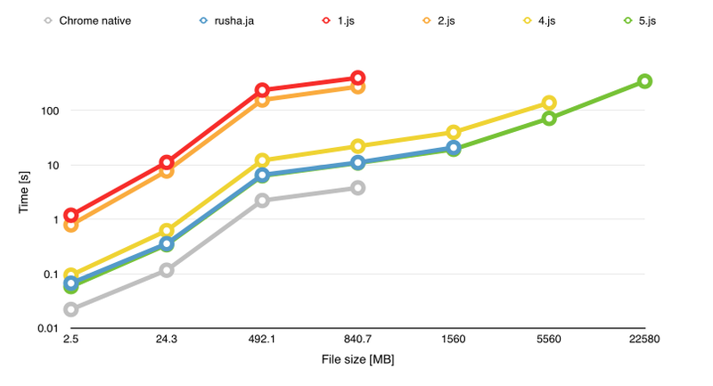

chunksha
========
Library to compute hash of a file in the browser 

## Why

There is a crypto api in the browser why not use it ?
Few things:
 
 * digest methods of crypto api accepts only single argument 
which is a byteArray to compute hash from so there is no update method to compute hash in chunks 
 * no progress report callback
 * no way to compute a hash of very large files > 3GB
 
 
## Goal

This is just a toy project to implement sha1 and fulfill the above

## Usage

```
<!DOCTYPE html>
<html>
  <head>
    <script src="src/5.js" charset="utf-8"></script>
    <script type="text/javascript" charset="utf-8">
      function handleFiles(files) {
        var worker = new Worker('src/5.js');
        worker.onmessage = function(e) {
          console.log(e.data);
        };
        worker.onerror = function (e) {
          console.log(e);
        };
        worker.postMessage(files[0]);
      }
    </script>
  </head>
  <body>
    <input type="file" id="input" onchange="handleFiles(this.files)">
  </body>  
</html>
```


## Tests

```
npm install mocha
mocha test/index5.js 
```

## Benchamarks

As a base to benchmark the library I've ised rusha.js implementation. 
Benchmark using sample files with different sizes.
All file based tests are done in the Chrome browser 
The 100k iteration test is done in nodejs.
All times are in seconds
To run the test browser start a simple http server to serve index.html file
the server is needed to overcome a webworker security error
**accessed from origin 'null'** 

```
python -m SimpleHTTPServer 8000
```

file         |   size   | base   | 1.js   | 2.js   | 4.js [s]| 5.js [s]| sha1
-------------|----------|--------|--------|--------------------------------------  
medium.mp4   |   2.5 MB |  0.067 |   1.19 |   0.79 |   0.094 |   0.058 | dce6ae98c6a7187b3e08b389edbeff47e9d2e8a3    
medium.zip   |  24.3 MB |  0.357 |  11.16 |   7.75 |   0.62  |   0.341 | b1ec91671e35882cd684db2b3b4c598db55a2544    
good-big.zip | 492.1 MB |  6.557 | 237.6  | 156.4  |  12.12  |   6.324 | 77d201055db8403e4079715bfccd8b442814cb34    
wrong.zip    | 840.7 MB | 11.102 | 400.1  | 275.0  |  22.14  |  10.871 | f7aa6d9265c8ec5f52b07f69f98c2740c91c4ce1    
mernis.tar.gz|  1.56 GB | 20.915 |        |        |  40.09  |  19.403 | aced1b7344c25b8c56fd330f66c19ae8cb9133a 
snapshot.sav |  3.23 GB |    X   |        |        |         |  37.559 | 204676dcc0fdea3789e57da893353572f0316a72
ubuntu.vdi   |  5.56 GB |    X   |        |        |         |  71.859 | 8dbcad7decb8eae2577bd45854e3a8111232dcba
windows.vmdk | 22.58 GB |    X   |        |        |         | 346.364 | 3ec5cc90676d136ba552b0a7d391932b81c2e155
100k iter    | 55 bytes |        |  74.2  |  65.4  |  65.4   |  38.7   |   





#### version 5 (current)
 
Few months passed since previous version 
New version of the Chrome browser support FileReaderSync 
Node version upgrade to 4.4.7
In the browser for files smaller than 1GB chunksha is slightly faster
For files bigger that 1GB it is 1.1 times slower than rusha.js
In my tests rusha crashed on 3GB file while chunksha continued to work.

#### version 4
In the browser 1.5 times slower than base implementation

#### version 2
In the browser 19 times slower than base implementation

#### verion 1
In the browser 28 times slower than base implementation

## Authors and Contributors

Wriiten by (@szydan), based on a great implementation (Rusha) by (@srijs)


